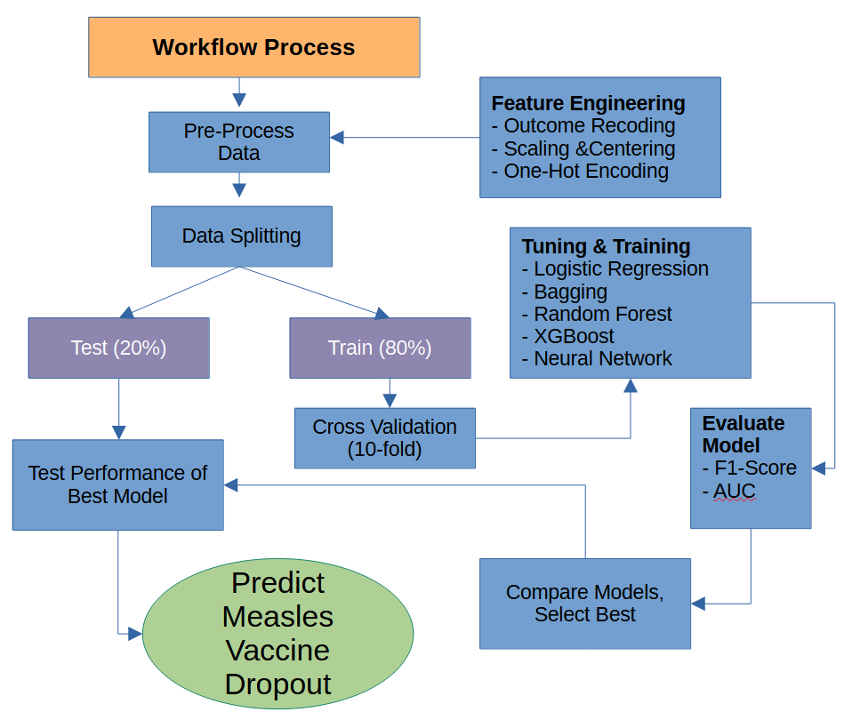

```{r include=FALSE}

knitr::opts_chunk$set(echo=FALSE, 
                      message=FALSE, warning=FALSE)

# packages needed
pacman::p_load(knitr, sjlabelled, haven, vip, kableExtra, sf, baguette, 
               bonsai, brulee, stacks, future, tictoc, 
               patchwork, viridis, ggthemes, janitor, tidymodels, tidyverse )

plan(multisession)

options(scipen = 999)

# variables  from child survey
var_ch <- c("HH1", "HH2", "HH6", "HH7", "IM26", "IM26A",
            "CAGE", "chweight","IM12A", "IM12B", "IM12C",
            "IM12D", "melevel", "wscore")


# variables from household survey
var_hh <- c( "HH1", "HH2", "HH52", "HC3", "HC4", "HC7G", 
             "HC8", "HC14", "WS1", "WS9","WS11", "HW3" )


# read in child survey first, join to household and mothers survey
file_path <- 
  "D://repos/UMD_classes_code/ML_social_science_SURV613/final/inputs/mics/Afghanistan/spss_dataset/"


survey_dat <-  read_sav(str_c(file_path, "ch.SAV")) |> 
             select(all_of(var_ch)) |> 
  
  # subset target group
  filter(CAGE >= 24, # age
         IM26 == 1) |>   # measles vaccine, yes or no

  # join household variables
  left_join(read_sav(str_c(file_path, "hh.SAV")) |> 
             select(all_of(var_hh)),
           # join by cluster and HH id
                     by = c( "HH1", "HH2")) |> 
  
  # convert variables to true doubles
  mutate(HC3 = factor(HC3),
         # convert labels to factors
         across(where(is_labelled),~ as_character(.x)),
         # capitalized only first letter in provicne name
         HH7 = str_to_title(HH7)) |> 
  rename(province=HH7) |> 
  # remove variables
  select(-CAGE) |> 
  # clean variable names
  janitor::clean_names() |> 
  # replace DN as NA across
  mutate(across(where(is.character), ~ na_if(.x, "DK"))) |> 
  # drop rows with missing data
  drop_na()


# read in province level data
prov_dat <- read_csv("D://repos/UMD_classes_code/ML_social_science_SURV613/final/inputs/world_bank/Afghanistan_province_indicators.csv") |> 
  tibble() |> 
  mutate(province = factor(province)) |> 
  # clean variable names
  janitor::clean_names()

# join data
survey_dat <- survey_dat |> left_join(prov_dat)


# correct province names to merge with shape file
position_names <- readRDS("D://repos/UMD_classes_code/ML_social_science_SURV613/final/shape_files/afghanistan_provincial_map.RDS") |> 
  rename(prov = province) |> 
  drop_na() |> 
  # renamne provinces
  mutate(prov = case_when(
           prov == "Daikundi"~ "Daykundi",
           prov == "Jawzjan"~ "Jowzjan",
           prov == "Wardak"~ "Maidan Wardak",
           prov == "Nimroz"~ "Nimruz",
           prov == "Sar-e-pul"~ "Sar-e Pol",
           prov == "Uruzgan"~ "Urozgan",
         TRUE ~ prov))


# read in shape file
map_shape_file <- st_read("D://repos/UMD_classes_code/ML_social_science_SURV613/final/shape_files/afghan_province/afghan_province.shp") |> 
  left_join(position_names)

```

## Introduction {#sec-intro}

Measles stands as a formidable global public health challenge as it is more contagious than Ebola or tuberculosis.
This virus continues to claim thousands of lives annually while disproportionately affecting the most vulnerable children under the age of five.
Afghanistan currently faces a critical situation, identified by the World Health Organization ([WHO](https://www.emro.who.int/images/stories/afghanistan/Outbreak-Situation-Report-Week-14-2024.pdf)) as a leading country experiencing significant measles outbreaks.
Underscoring this urgency, the WHO reported nearly 13,000 measles cases among Afghan children under five in 2024 alone.
This highlights the pervasive risk and the pressing need for effective preventative measures.

The cornerstone of measles prevention lies in achieving widespread immunity through vaccination.
The Measles, Mumps, and Rubella (MMR) vaccine offers highly effective protection.
Full immunity requires a two-dose regimen, and in Afghanistan it is typically recommended to be completed by the time a child reaches 24 months.
Encouragingly, these vaccines are relatively inexpensive and should be readily available.
However, a significant gap exists between the availability of the vaccine and achieving protective population immunity.

The benchmark for effective measles control and the potential for elimination is reaching and maintaining at least 95% two-dose vaccination coverage.
According to [UNICEF](https://www.unicef.org/stories/measles-cases-spiking-globally) data from 2023, measles vaccine coverage in Afghanistan has stalled at approximately 83%.
Crucially, this figure often reflects at least one dose, masking a more dangerous problem called vaccination dropout.
Measles vaccination dropout occurs when children receive their initial measles vaccine dose but fail to return for the essential second dose.
This incomplete vaccination leaves them insufficiently protected and contributes to the persistence of measles transmission within the com

Measles vaccination dropout is driven by several interconnected factors within the Afghan context such as; ongoing instability and conflict forcing population displacement and the disruption of established immunization schedules, geographic remoteness posing a challenge for vaccines to reach their intended audience, a fragile health infrastructure lacking systematic tracking and reminder systems for vaccinations, and household poverty and low levels of education which hinder health seeking behaviors.
To add to these factors, a new challenge emerged this year with the incoming US administration drastically minimizing foreign aid to this part of the world.
These combined challenges underscore the critical need for innovative approaches, such as deploying tailored interventions informed by predictive modeling to identify and support children most likely to miss their crucial second dose.
The primary goal of this study is to construct and validate a robust classification model using 2023 UNICEF MICS and World Bank data to identify Afghan children at high risk of measles vaccination dropout, comparing XGBoost with other methods and highlighting key predictors to guide public health efforts.

## Method {#sec-method}

#### *Inputs*

The analytical basis for this study is derived from robust, multi-level data collected in Afghanistan in 2023.
Our primary source is the 2023 Afghanistan Multiple Indicator Cluster Survey ([MICS](https://mics.unicef.org/surveys)), conducted under the auspices of UNICEF.
The MICS is a multi-stage cluster sampling design with systematic selection of households using proportionate allocation.
Only households with children are eligible to partake in this survey.
The MICS is designed to collect statistically rigorous data on a wide range of indicators concerning the health, development, and wellbeing of children and women.

From this rich dataset, we identified a specific cohort relevant to understanding MMR vaccine dropout.
Our sample consists of 1,067 children who were 24 months and older at the time of the survey and who had received at least one dose of the measles vaccine.
From this sample, eight percent had missing information and were dropped from analysis resulting in 971 children.
The age threshold ensures that the children were generally past the recommended age for receiving the second dose, making it possible to assess dropout.
We aim to predict the key outcome measles vaccination dropout.
We used responses to two questions from the MICS survey about having been vaccinated with MMR and how many times.
We used this information to create a binary outcome variable coded as follows:

-   Coded as 1: Children who received the first measles vaccine dose but had *not* received the second dose by the time of the survey—representing dropout—39 percent.

-   Coded as 0: Children who had received *both* the first and second doses—representing completion—61 percent.

#### *Machine Learning Algorithms*

We compared various supervised ML models such as logistic regression, Bagging, Random Forest, Neural Networks and XGBoost to identify the most effective model at predicting the target variable based on performance metrics.
Hyperparameter optimization was conducted via a 10-fold cross-validation procedure, with an 80% training/testing partition.
We assessed model performance using the AUC-ROC, which provides a measure of discriminatory power.
The ROC allows us to evaluate the trade-off between sensitivity and 1 – specificity at various tuning parameters, while AUC will provide us with an evaluation of how well the model correctly classifies vaccination dropout.
Additionally, we also used the F1-score, a harmonic mean of precision and recall, serves as a balanced indicator of a model’s ability to correctly identify relevant instances while minimizing both false positives and false negatives.
We choose these metrics as we are interested in correctly classifying true positive cases while minimizing false positives as we aim to to produce a model that works best when foreign aid is limited as to not be wasteful in using resources on false positives.
Figure 1 captures our workflow for this project in identifying the best model to predict measles vaccine dropout.

{width="622"}

#### *Feature Selection*

We chose 10 features from the MICS survey to represent the contextual factors that drive measles vaccine dropout such as household characteristics (e.g., access to electricity and running water, house construction materials ), family socieconomics (e.g., wealth score calculated by MICS) , mother's education level, and family participation in national immunization campaigns.
Moreover, there were four national immunization campaigns in the country and the MICS asked respondents to identify which event they attended.
For illustration purposes we collapsed these four variables into one and coded it as attending one event (e.g., some), two or three events (e.g., half), or all four events (e.g., all) which can be seen on the x-axis in Figure 2, in addition to rural vs urban, and mother's education level as they relate to the target variable.
We can see from this figure that the rural-urban divide is important for understanding the outcome alongside mother's education level which seems to correlate with participation in the immunization campaigns.

The MICS contains information about which province children live in; therefore, we were able to leveraged [World Bank](https://www.worldbank.org/en/data/interactive/2019/08/01/afghanistan-interactive-province-level-visualization) indicators for each Afghan province to provide additional geographic contextual features.
This province indicators include conflict score with values closer to 100 indicating extreme instability from armed conflict, female literacy rate, health infrastructure with scores closer to 100 indicating greater delivery of medical goods to the public, population density, and poverty rate.
Table 1 presents features used to predict the target outcome.
We present in Figure 3 the breakdown in the target variable distributed across the provinces as well as show health institution availability and female literacy rates.
We can see variation in the provinces across these indicators and our outcome variable.
Overall we had 22 features in total to predict the target variable.

```{r}
#| fig-width: 8
#| fig-height: 11
#| 
# Create outcome variable
dat <- survey_dat |> 
  mutate(outcome = ifelse(im26a == "ONE", "dropped", "completed"),
         outcome = relevel(factor(outcome), ref="dropped")) |> 
  # drop variables not needed
  select(-hh1, -hh2, -chweight, -im26, -im26a) 


# extract labels for feature selection
feature_selection <- dat |> 
  get_label() |> 
  as.data.frame() |> 
  rownames_to_column() |> 
  rename(variable=1, label=2) |> 
  filter(variable != "province") |> 
  mutate(label = ifelse(variable=="hc3", 
                        "Number of Room in House", label)) 


# feature engineering
dat <- dat |> 
  mutate(
    # combine campaign participation into 1 feature
    im12a = ifelse(im12a =="YES", 1, 0),
    im12b = ifelse(im12b =="YES", 1, 0),
    im12c = ifelse(im12c =="YES", 1, 0),
    im12d = ifelse(im12d =="YES", 1, 0),
    campaign = im12a + im12b + im12c + im12d,
    # collapse campgin into responses
    campaign = case_when(
      # there are only 14 0s
      between(campaign, 0, 1) ~ "some",
      campaign == 2 ~ "half",
      campaign ==3 ~ "half",
      campaign == 4 ~ "all"),
    campaign = fct_relevel(campaign, c("all","half", "some")), 
    # shorten response categories by collapsing secondary
    ## less than 14 % were secondary or higher, 7% primary
    melevel = case_when(
      melevel == "Pre-primary/ECE or none" ~ "Primary/None",
      melevel == "Primary" ~ "Primary/None",
      melevel == "Lower Secondary" ~ "secondary/higher",
      melevel == "Upper Secondary" ~ "secondary/higher",
      melevel == "Higher" ~ "secondary/higher"),
    # main source of drinking water has lots of categories, collapse
    ws1 = case_when(
      str_detect(ws1, "PIPED") ~ "city",
      str_detect(ws1, "WELL") ~ "well",
      TRUE ~ "other"),
    # hc4, type of household floor material has 7 categories, collapse
    hc4 = case_when(
      str_detect(hc4, "EARTH") ~ "dirt",
      str_detect(hc4, "CARPET") ~ "carpet",
      TRUE ~ "other"),
    # collapse yes no responses to having electricity
    hc8 = case_when(
      str_detect(hc8, "NO") ~ "no electricity",
      str_detect(hc8, "GRID") ~ "grid",
      str_detect(hc8, "GENERATOR") ~ "generator"),
    # type of toilet has 12 categories, collapse 
    ws11 = case_when(
      str_detect(ws11, "SEWER") ~ "sewer",
      str_detect(ws11, "SEPTIC") ~ "septic",
      str_detect(ws11, "PIT") ~ "pit",
      str_detect(ws11, "BUSH") ~ "outhouse",
      str_detect(ws11, "LATRINE") ~ "latrine",
      TRUE ~ "other"),
    # collapse yes no responses for having hand soap in bathroom
    hw3 = case_when(
      str_detect(hw3, "NO") ~ "no",
      str_detect(hw3, "YES") ~ "yes"),
    across(where(is.character), ~ str_to_lower(.x)),
    ) 


# plot some of the features for figure 2
dat |>
  count(outcome, campaign, hh6, melevel) |>
  group_by(campaign, hh6, melevel) |>
  mutate(prop = n / sum(n)) |>
  ungroup() |>
  ggplot(aes(x = campaign, y = outcome, fill = outcome,
             text = paste0("<b>", outcome, "</b>",
                           "<br>Campaign: ", campaign,
                           "<br>Share: ", scales::percent(prop, accuracy = 1),
                           "<br>Count: ", n))) +
  geom_tile(aes(alpha = prop), color = "white", linewidth = 0.6) +
  geom_text(aes(label = ifelse(prop >= 0.05,
                               scales::percent(prop, accuracy = 1),
                               "")),
            size = 3.5, fontface = "bold", color = "white") +
  facet_grid(rows = vars(melevel), cols = vars(hh6)) +
  scale_fill_viridis_d(option = "rocket", begin = 0.50, end = 0.85,
                       direction = 1, alpha = 0.85) +
  scale_alpha_continuous(range = c(0.4, 1), guide = "none") +
  guides(fill = guide_legend(reverse = TRUE)) +
  labs(
    x = "Campaign Participation",
    y = "Outcome",
    title = "Figure 2. Risk for dropping decreases with national immunization campaign exposure, varies by mothers' education level and rural/urban divide."
  ) +
  theme_minimal() +
  theme(
    strip.text = element_text(face = "bold", size = 10),
    axis.text.x = element_text(angle = 45, hjust = 1)
  )


feature_selection |> 
  kable(caption = "Features Used For Predicting Measles Vaccine Dropout")


# fix province names to match wtih shape files
dat  <- dat |> 
  rename(prov = province) |> 
  mutate(prov = str_to_title(prov),
         prov = case_when(
           prov == "Jawzjan"~ "Jowzjan",
           prov == "Kunarha" ~ "Kunar",
           prov == "Nimroz"~ "Nimruz",
           prov == "Nooristan" ~ "Nuristan",
           prov == "Paktya" ~ "Paktia",
           prov == "Panjsher" ~ "Panjshir",
           prov == "Sar-E-Pul" ~ "Sar-e Pol",
         TRUE ~ prov)
  )


# combine outcome by region
dat_province <- dat |> 
  select(prov, conflict_index:outcome) |> 
  mutate(outcome = ifelse(outcome == "dropped", 1, 0)) |> 
  group_by(prov) |> 
  reframe(outcome = mean(outcome),
         health_institutional_delivery = mean(health_institutional_delivery),
         female_literacy_rate = mean(female_literacy_rate))


map_shape_file <- map_shape_file |> 
  left_join(dat_province) 

p1 <- ggplot(map_shape_file) +
  geom_sf(aes(fill = outcome)) +
  geom_text(aes(position_x, position_y, label = prov),  size = 3, color="white") +
  theme(plot.title = element_text(hjust = 0.5, size = 16)) +
  theme_map() +
  scale_fill_viridis(option="mako", direction = -1) + 
  labs(title = "Figure 3. Proportion of Measles Vaccine Dropout in Afghanistan",
       fill = NULL)


p2 <- ggplot(map_shape_file) +
  geom_sf(aes(fill = health_institutional_delivery), show.legend = FALSE) +
  theme(plot.title = element_text(hjust = 0.5, size = 16)) +
  theme_map() +
  scale_fill_viridis(option="mako", direction = -1) + 
  labs(title = "Health Institution Availability",
       fill = NULL)


p3 <- ggplot(map_shape_file) +
  geom_sf(aes(fill = female_literacy_rate), show.legend = FALSE) +
  theme(plot.title = element_text(hjust = 0.5, size = 16)) +
  theme_map() +
  scale_fill_viridis(option="mako", direction = -1) + 
  labs(title = "Female Literacy Rate",
       fill = NULL)

p1 / (p2 | p3)  


```

#### 

```{r, include=FALSE}
#__________________________________________________________________________
#___ The following models were processed before hand and saved on github___
#__________________________________________________________________________


# modeling 
set.seed(909)

mod_dat <- dat |> 
  mutate(outcome = relevel(outcome, ref = "completed")) |> 
  select(-prov, -campaign)


dat_split <- initial_split(mod_dat,  prop = .80, breaks = 2)
dat_train <- training(dat_split) # train split
dat_test <- testing(dat_split) # test split

# print outcome proportions from split
dat_train |> select(outcome) |> mutate(splits = "train") |> 
  add_row(dat_test |> select(outcome) |> mutate(splits = "test")) |> 
  group_by(splits) |> 
  count(outcome) |> 
  mutate(prop = n/sum(n)) |> 
  kable()

# CV 10 fold
cv_split <- vfold_cv(dat_train, v=10)

# define preprocessing steps
rec <-  recipe(outcome~., data=mod_dat) |> 
  # create binary terms for categories
  step_dummy(all_nominal_predictors(), one_hot = TRUE)  |>  
  # scale and center continuous predictors
  step_normalize(all_double_predictors()) 


# set performance metrics
eval_metrics <- metric_set(roc_auc, f_meas)

# for confusion matrix
update_geom_defaults(geom = "rect", new = list(fill = "dodgerblue", alpha = 0.7))


# ______________________________ Helpful functions for modeling ________________________________


# tune model 
tune_model_fun <- function(work_flow, tuning_grid){
  work_flow |> 
   tune_grid(
     resamples = cv_split, 
     grid = tuning_grid, 
     control = control_grid(allow_par = TRUE,
                            parallel_over = "resamples", 
                            save_pred = TRUE),
     metrics = eval_metrics)
}


# create final model fit to the test set, generate predictions
finalize_mod_fun <- function(mod_wf, mod_optimal){
  
  # finalize the model on the test set
  mod_final = finalize_workflow(mod_wf, mod_optimal) |> 
    last_fit(dat_split)

  # get predictions from final model
  predictions <- mod_final |> 
    collect_predictions()
  
  return(predictions)
}


# extract model performance
mod_performance_fun <- function(mod_predictions, mod_name){
    
  # pull metrics out
  tibble(
    f1_score = mod_predictions |> f_meas(truth=outcome, estimate = .pred_class) |> 
      pull(),
    roc_auc = mod_predictions |> roc_auc(truth=outcome, 
                                         .pred_dropped, event_level="second") |> 
      pull(), 
    model = mod_name)
  
}


# generate confusionmatrix plot
conf_matrix_fun <- function(mod_predictions){
    
  mod_predictions |> 
    mutate(.pred_class = relevel(.pred_class, "dropped"),
           outcome = relevel(outcome, "dropped")) |> 
    conf_mat(truth = outcome, estimate=.pred_class) |> autoplot()
}


# ____________________________________________________________________
# model processing 


# _____ logistic regression ______________

# step 1, build the model w/ penalized parameter
lr_mod <- 
  logistic_reg(penalty = tune(), # let tune be set automatically to tune later
               mixture = tune()) |> # 1 means remove irrelevant predictors (lasso)
  set_mode("classification")  |> # for binary outcomes
  set_engine("glmnet") # the algorithm

# step 2, create work flow
lr_wf <- workflow() |> 
  add_model(lr_mod) |> 
  add_recipe(rec) 


#_____________ create tuning grid, and train & tune model  ______________

# we set how many candidates of the penalty parameter to evaluate on

# lr_tune_grid <- extract_parameter_set_dials(lr_mod) |> 
#  grid_space_filling(penalty(), mixture(), size=100) |> 
#   filter(penalty < .2)
# 
# tic()
# lr_res <- tune_model_fun(lr_wf, lr_tune_grid)
# toc()
#  
# save model output
# saveRDS(lr_res, "D://repos/UMD_classes_code/ML_social_science_SURV613/final/outputs/lr_res.RDS")

# read in models
lr_res <- readRDS("D://repos/UMD_classes_code/ML_social_science_SURV613/final/outputs/lr_res.RDS")


lr_optimal <- lr_res |> 
    select_best(metric="f_meas") 

lr_predictions <- finalize_mod_fun(lr_wf, lr_optimal)

lr_performance <- mod_performance_fun(lr_predictions, mod_name = "lr")


# _____ Neural Network ______________

# step 1, build the model w/ penalized parameter
nnet_mod <- 
  mlp(epochs = tune(), 
      hidden_units = tune(), 
      penalty = tune()
      ) |>  
  set_mode("classification")  |> # for binary outcomes
  set_engine("nnet") # the algorithm

# step 2, create work flow
nnet_wf <- workflow() |> 
  add_model(nnet_mod) |> 
  add_recipe(rec) 


#_____________ create tuning grid, and train & tune model  ______________

# we set how many candidates of the tuning parameter to evaluate on
# nnet_tune_grid <- grid_space_filling(penalty(), epochs(), hidden_units(), size=500)
# 
# tic()
# nnet_res <- tune_model_fun(nnet_wf, nnet_tune_grid)
# toc()

#saveRDS(nnet_res, "D://repos/UMD_classes_code/ML_social_science_SURV613/final/outputs/nnet_res.RDS")

# read in models
nnet_res <- readRDS("D://repos/UMD_classes_code/ML_social_science_SURV613/final/outputs/nnet_res.RDS")


# run functions
nnet_optimal <- nnet_res |> select_best(metric="f_meas") 

nnet_predictions <- finalize_mod_fun(nnet_wf, nnet_optimal)

nnet_performance <- mod_performance_fun(nnet_predictions, mod_name = "nnet")


# _____ BAGGING ______________

# workflow

# step 1, build the model w/ penalized parameter
bag_mod <-   bag_tree(tree_depth = tune(), 
                      cost_complexity = tune(),
                      min_n =tune() ) |> 
  set_engine("rpart", times = 100) |>
  set_mode("classification")


# step 2, create work flow
bag_wf <- workflow() |> 
  add_model(bag_mod) |> 
  add_recipe(rec) 


#_____________ create tuning grid, and train & tune model  ______________

# bag_tune_grid <- expand_grid(
#  cost_complexity = seq(.0001,.01, .001),
# min_n = c(8, 10, 12),
# tree_depth = seq(2, 6)
# )
# 
# #tune model
#  tic()
#  bag_res <- tune_model_fun(bag_wf, bag_tune_grid)
#  toc()
# 
# # save model output
# saveRDS(bag_res, "D://repos/UMD_classes_code/ML_social_science_SURV613/final/outputs/bag_res.RDS")

# read in models
bag_res <- readRDS("D://repos/UMD_classes_code/ML_social_science_SURV613/final/outputs/bag_res.RDS")


bag_optimal <- bag_res |> select_best(metric="f_meas") 

  
# finalize the model on the test set
bag_final <- finalize_workflow(bag_wf, bag_optimal) |> 
  last_fit(dat_split)

# fun functions
bag_predictions <- finalize_mod_fun(bag_wf, bag_optimal)

bag_performance <- mod_performance_fun(bag_predictions, mod_name = "bagging")


# _____ RANOM FOREST ______________

# workflow

# step 1, build the model w/ penalized parameter
rf_mod <- rand_forest(mtry = tune(),  trees = tune(), min_n = tune()) |>
  set_engine("ranger") |>
  set_mode("classification")

# step 2, create work flow
rf_wf <- workflow() |> 
  add_model(rf_mod) |> 
  add_recipe(rec) 


#_____________ create tuning grid, and train & tune model  ______________

#we set how many candidates of the penalty parameter to evaluate on
# rf_tune_grid <- expand_grid(
#  mtry = seq(3, 10),
#  min_n = seq(8, 16),
#  trees = seq(500, 2000, 500)
# )
# 
# tic()
# rf_res <- tune_model_fun(rf_wf, rf_tune_grid)
# toc()
# 
# # save model output
# saveRDS(rf_res, "D://repos/UMD_classes_code/ML_social_science_SURV613/final/outputs/rf_res.RDS")

# read in models
rf_res <- readRDS("D://repos/UMD_classes_code/ML_social_science_SURV613/final/outputs/rf_res.RDS")


# run functions
rf_optimal <- rf_res |> select_best(metric="f_meas") 

rf_predictions <- finalize_mod_fun(rf_wf, rf_optimal)

rf_performance <- mod_performance_fun(rf_predictions, mod_name = "rf")


#______ Preprocess modeling steps _________
# _____ XGBOOST  ______________

# workflow


# step 1, build the model w/ penalized parameter
xgb_mod <-
  boost_tree(# create tuning grid
    tree_depth = tune(), # number of splits
    mtry = tune(),
    learn_rate = tune(), # shrinkage
    loss_reduction = tune(), # reduction in the loss function required to split
    trees = tune(), # trees contained in ensemble
    sample_size = tune(),
    min_n = tune()) |> # classification for binary data
  set_engine("xgboost") |>
  set_mode("classification")

# step 2, create work flow
xgb_wf <- workflow() |> 
  add_model(xgb_mod) |> 
  add_recipe(rec) 

#_____________ create tuning grid, and train & tune model  ______________


# create tuning grid
# boost_tune_grid <- grid_latin_hypercube(
#   tree_depth(),
#   min_n(),
#   trees(),
#   loss_reduction(),
#   sample_size = sample_prop(),
#   finalize(mtry(), dat_train),
#   learn_rate(),
#   size = 1000
# ) |>
#   filter(
#     tree_depth < 10,
#     mtry < 10,
#     min_n > 8,
#     learn_rate < .02,
#     loss_reduction < .01,
#   )
# 
# tic()
# xgb_res <- tune_model_fun(xgb_wf, boost_tune_grid)
# toc()
# 
# 
# # save model output
# saveRDS(xgb_res, "D://repos/UMD_classes_code/ML_social_science_SURV613/final/outputs/xgb_res.RDS")

# read in models
xgb_res <- readRDS("D://repos/UMD_classes_code/ML_social_science_SURV613/final/outputs/xgb_res.RDS")


# run functions
xgb_optimal <- xgb_res |> select_best(metric="f_meas") 

xgb_predictions <- finalize_mod_fun(xgb_wf, xgb_optimal)

xgb_performance <- mod_performance_fun(xgb_predictions, mod_name = "xgb")


```

#### *Feature Engineering*

Across our factor features we collapsed levels when appropriate, such as when very few cases were observed in obscure levels.
For instance, very few mothers in the survey had a secondary or higher education (e.g., \< 14 percent) and therefore we collapsed all levels secondary and above together.
Alternatively, very few had no formal education and we collapsed this level with primary education.
Access to water feature factor levels were collapsed into city, well, or other as well as access to plumbing levels were collapsed into sewer, septic, pit, outhouse, latrine, and other.
One shot encoding was used for factor levels and quantitative variables such as the family wealth score and province indicators were scaled and centered.

## Results

For computation we used the r-language and conducted all of our modeling using tidymodels.
We tuned hyperparameters using cross validation during model training and choose models with the best AUC and F1-scores.
We start with the logistic regression as a base learner to compare against ensemble methods that require parameter tuning.
We show parameter tuning values in Figures 4 and 5 for all five models.

The logistic regression was only tuned for the penalty parameter and was the less demanding algorithm to compute.
Bagging was tuned for cost complexity between .00001 and .001, minimum number of n (e.g., 8, 10, 12 shown as columns in Figure 4), and tree depth between 2 to 6.
Random forest was tuned for number of mtry to use between 3 to 10 (e.g., ), minimum n between 8 to 16 (e.g., shown as columns in Figure 4), and number of trees (e.g., 500, 1000, 1500, 2000).
Neural networks using the nnet engine we tuned parameters penalty (i.e., amount of regularization, epochs, and hidden units).
For this model we used the `dials::grid_space_filling()` function which is used to construct parameter grids that try to cover the parameter space in a way that the parameter space does not have observed combinations that are close to one another.
This resulted in 300 combinations to use for tuning and can be seen in Figure 5.
The XGBoost had the most parameters to tune and again we relied on `dials::grid_latin_hypercube()` which achieves something similar to that what we used in the neural network.
This allowed us to tune tree depth, minimum node size, number of trees, minimum loss reduction, sample size (e.g., proportion observation samples, mtry, and learning rate resulting in training with 500 combinations of these parameters shown in Figure 5.

\newpage

Figure 4.
Hyperparameter Tuning for ML Model Training

```{r}
#| fig-width: 8
#| fig-height: 11
#| 
p1 <- lr_res |> 
  collect_metrics() |> 
  ggplot(aes(x=penalty, y=mean, color=.metric)) + 
  geom_line() +
  geom_point() +
  scale_color_viridis_d(option = "plasma", end = .75) +
  theme_hc() +
  ggtitle("Logistic Regression")


p2 <- bag_res |> 
  collect_metrics() |> 
  ggplot(aes(x=cost_complexity, y=mean, color=as.character(tree_depth))) + 
  geom_line() +
  geom_point() +
  facet_grid(rows=vars(.metric), cols=vars(min_n)) +
  scale_color_viridis_d(option = "plasma", end = .75) +
  scale_x_discrete(guide = guide_axis(n.dodge=3)) +
  theme_hc() +
  ggtitle("Bagging")


p3 <- rf_res |> 
  collect_metrics() |> 
  ggplot(aes(x=trees, y=mean, color=as.character(mtry))) + 
  geom_line() +
  geom_point() +
  facet_grid(rows=vars(.metric), cols=vars(min_n)) +
  scale_x_discrete(guide = guide_axis(n.dodge=3)) +
  scale_color_viridis_d(option = "plasma", end = .75) +
  theme_hc() +
  ggtitle("Random Forest")

  
(p1 | p2) / p3  
  
```

\newpage

Figure 5.
Continuation of Hyperparameter Tuning for ML Model Training

```{r}
#| fig-width: 8
#| fig-height: 11

p4 <- 
nnet_res |> 
  collect_metrics() |> 
  filter(.metric == "f_meas") |> 
  select(hidden_units:epochs, mean) |> 
  rename(F1_score=mean) |> 
  #mutate(epochs=factor(epochs)) |> 
  ggplot(aes(x=epochs, y=F1_score, color=penalty)) +
  geom_point( alpha = 0.8, show.legend = TRUE) +
  facet_grid(~hidden_units) +
  scale_x_discrete(guide = guide_axis(n.dodge=3)) +
  scale_color_viridis(option = "plasma", end = .75) +
  theme_hc() +
  ggtitle("Neural Network")
  

p5 <- xgb_res |> 
  collect_metrics() |> 
  filter(.metric == "f_meas") |> 
  select(mtry:sample_size, mean) |> 
  pivot_longer(-c( "mean"), 
               values_to = "value",
               names_to = "parameter") |> 
  rename(Score=mean) |> 
  ggplot(aes(x=value, y=Score, color = parameter)) +
  geom_point(alpha = 0.8, show.legend = FALSE) +
  scale_x_discrete(guide = guide_axis(n.dodge=3)) +
  facet_wrap(~parameter, scales = "free_x") +
  scale_color_viridis_d(option = "plasma", end = .75) +
  theme_hc() +
  ggtitle("XGBoost")
  
  
 p4 / p5
  


```

Once we picked our best models for each algorithm based on F1-scores and the AUC we applied the best model to the test set and predicted measles vaccine dropout for each one.
We present performance metrics for each final model on the test set in Figure 6.
All of the models were very close in performance yet we chose the neural network model because it performed the best on the F1-score (.722) yet came in second place after random forest on AUC (.633).
These scores are not great but they do better than random chance.
Figure 7 presents the most important variables for interpretability purpose.

```{r}
#| fig-width: 7
#| fig-height: 6
#| 
# predict on validation set
# combine predictions
p1 <- lr_predictions |> 
  mutate(model="lr") |> 
  add_row(nnet_predictions |> mutate(model="nnet") ) |> 
  add_row(bag_predictions |> mutate(model="bagging") ) |> 
  add_row(rf_predictions |> mutate(model="rf") ) |> 
  add_row(xgb_predictions |> mutate(model="xgb") ) |> 
  mutate(model =fct_reorder(model, .pred_dropped, mean)) |> 
  group_by(model) |> 
  roc_curve(truth=outcome, .pred_dropped, event_level = "second") |> 
  # plot both
  ggplot(aes(x = 1 - specificity, y = sensitivity, color=model)) + 
  geom_path(lwd = 1.5, alpha = 0.8, show.legend = FALSE) +
  coord_equal() + 
  scale_color_viridis_d(option = "magma", end = .9, alpha=.8) +
  theme_hc() +
  labs(title="Figure 4. Final Model Selection Predicting 
       Target Variable in Test Set.")

p2 <- # combine test error estimates
lr_performance |> 
  full_join(nnet_performance) |> 
  full_join(bag_performance) |> 
  full_join(rf_performance) |> 
  full_join(xgb_performance) |> 
  pivot_longer(-model, names_to="Performance_Metric", values_to = "Score") |> 
  mutate(model =fct_reorder(model, Score, mean)) |> 
  ggplot(aes(x=Performance_Metric, y=Score, fill=model)) +
  geom_col(position = "dodge") +
  theme_hc() +
  scale_fill_viridis_d(option="magma", end=.9, alpha=.8)

(p1 + p2) +  plot_layout(guides = "collect") & theme(legend.position = 'bottom')
```

```{r}

nnet_final <- finalize_workflow(nnet_wf, nnet_optimal) |> 
  last_fit(dat_split)

# view variable importance
nnet_final |> 
  extract_fit_parsnip() |>
  vi()|> 
  mutate(
    Importance = abs(Importance),
    Variable = fct_reorder(Variable, Importance)) |>  
  dplyr::slice(1:10) |> 
  ggplot(aes(x = Importance, y = Variable)) +
  geom_col() +
  scale_x_continuous(expand = c(0, 0)) +
  labs(y = NULL) +
  scale_fill_viridis_d(option="mako", begin =.50, end = .85, 
                       alpha=.85, direction=-1) +
  theme_hc() + 
  labs(title="Figure 7. Neural Network Most Important Predictors")
  


```

## Discussion

This study aimed to predict measles vaccination dropout among Afghan children using machine learning with 2023 MICS and World Bank data.
We found the neural network model performed best, exceeding random chance but with moderate performance.
This highlights the challenge of predicting dropout in this complex setting.
Key predictors identified by the model, such as provincial population density, number of rooms per house, having a septic tank, and renting home.
These findings underscore the multifaceted nature of vaccination dropout.
While imperfect, the models offer a valuable tool for public health efforts.
These can help identify at-risk children and regions, they can assist in targeting limited resources and interventions more effectively, address factors like health service access, and campaign outreach.

Limitations include reliance on the small samples size of almost 1,000 respondents, necessary feature simplification such as collapsing factors, and a reliance on tool parameter specification for for model tuning.
Future work could explore richer data sources or refined modeling techniques.
In conclusion, this research demonstrates the utility of machine learning for identifying children at risk of measles vaccination dropout in Afghanistan.
The models, despite limitations, provide actionable insights to guide targeted public health strategies aimed at improving crucial two-dose vaccination coverage.
